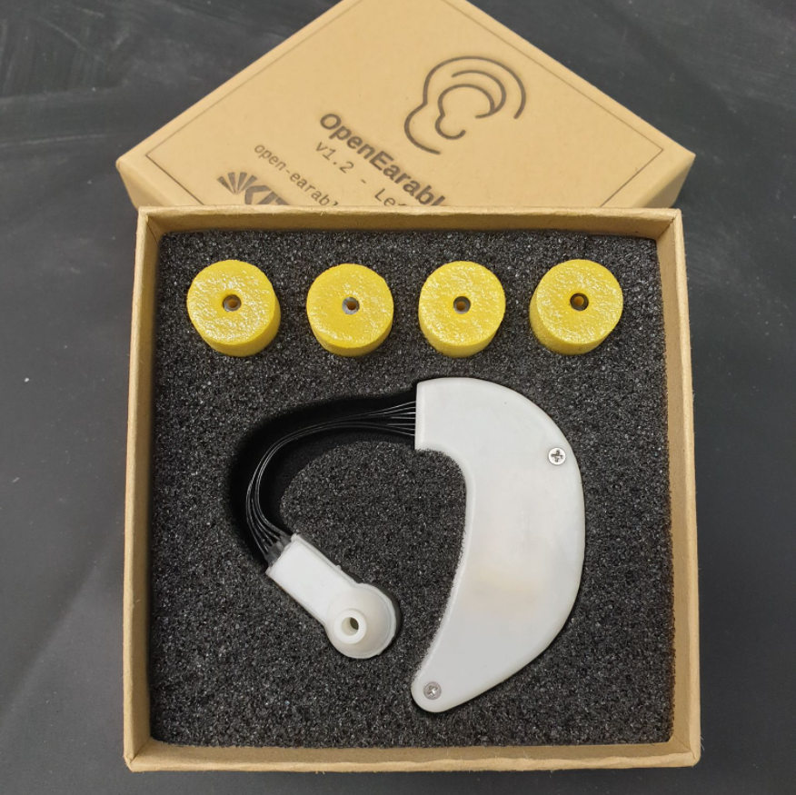

# 🦻 open-earable

OpenEarable is a new, open-source, Arduino-based platform for ear-based sensing applications. It provides a versatile prototyping platform with support for various sensors and actuators, making it suitable for earable research and development.

<p align="center" width="100%">
     
</p>


## Table of Contents
- [Introduction](#Introduction)
- [Setup](#Setup)
  - [C++ Libraries](#C++-Libraries)
  - [SD Card Setup](#SD-Card-Setup)
  - [SPI Setup](#SPI-Setup)
  - [sdfat Library Setup](#sdfat-Library-Setup)
- [Usage](#Usage)
  - [Example](#Example)
  - [Dashboard](#Dashboard)
  - [EdgeML](#EdgeML)
- [BLE Specification](#BLE-Specification)
- [Firmware Internals](#Firmware-Internals)
  - [Bootloader](#Bootloader)
  - [Pin Configuration](#Pin-Configuration)
  - [Earable](#Earable)
  - [Sensor Configuration](#Sensor-Configuration)
  - [Button](#Button)
  - [LED](#LED)
- [Cite](#Cite)

## Introduction

OpenEarable is designed to enable ear-based sensing applications by offering a flexible and open-source hardware platform. It incorporates a range of sensors, including a 9-axis inertial measurement unit, an ear canal pressure and temperature sensor, an inward-facing ultrasound microphone, a speaker, a push button, and a controllable RGB LED. With these features, OpenEarable provides researchers and developers with the ability to explore various application scenarios. 
For more information visit the [OpenEarable](https://open-earable.teco.edu/) website.

OpenEarable is controlled and streams sensor data via BLE (Bluetooth Low Energy). Audio is played from and recorded to the internal SD card. OpenEarable is compatible with the provided [dashboard](https://github.com/OpenEarable/dashboard) and [edge-ml](https://edge-ml.org/). 


## Setup

### C++ Libraries
The following C++ Libraries have to be installed in your Arduino IDE:
- [EdgeML-Arduino](https://github.com/edge-ml/EdgeML-Arduino)
- [Adafruit_BMP280](https://github.com/adafruit/Adafruit_BMP280_Library)
- [DFRobot_BMX160](https://github.com/DFRobot/DFRobot_BMX160)
- [ArduinoBLE](https://github.com/arduino-libraries/ArduinoBLE)
- [SdFat Adafruit Fork (Bill Greiman)](https://github.com/adafruit/SdFat)


### SD Card Setup
In order to be compatible with the open earable library the SD card needs to be formatted with the exFAT format.
Make sure to have a sufficiently fast SD card. (Recommended SD Card: SandDisk class 10 and class A30)

### SPI Setup

The default Arduino implementation of the SPI library does not meet the required speed. To address this, optimized SPI files are provided. Follow the steps below to integrate these files into Arduino.
All referenced files can be found in the "resources" folder in the "spi_files" subfolder.

To fully integrate the optimized SPI files, changes to the Arduino Nano 33 BLE board files have to be made. Follow the steps below to accomplish this:

1. Open the Arduino IDE.

2. In the top left corner, click on "File."

3. From the dropdown menu, select "Preferences."

4. At the bottom of the new window, there is a hyperlink labeled under "More preferences can be edited directly in the file". Click on this hyperlink to access the file explorer.

5. Inside the "packages" folder, navigate to the following directory: `arduino/hardware/mbed_nano/4.0.4/libraries`.

6. Locate the existing SPI library folder within this directory. It needs to be swapped with the provided folder named "SPI" in "resources/spi_files"".

7. Similarly, navigate to the following directory: `arduino/hardware/mbed_nano/4.0.4/cores/arduino/mbed/targets/TARGET_NORDIC/TARGET_NRF5x/TARGET_SDK_15_0/modules/nrfx/drivers/include`.

8. In this directory, locate the file named "nrfx_spi.h" and replace it with the provided "nrfx_spi.h" file from the "resources/spi_files" folder.

9. Additionally, paste the "nrfx_spim.c" file from the "resources/spi_files" subfolder into the same directory.

### sdfat Library Setup
One of the library requirements is the Adafruit Fork of the SdFat library from Bill Greiman.
This library is used to send data to the SD card.
If the Arduino default SD Card library is used or if the SdFat library is used without changing its configurations OpenEarable data transfer is very slow topping about 33kbps.
This is not sufficient to record audio.

However, with the SdFat library it is possible to get write speeds of up to 400kbps without the SPI changes and up to 1.5Mbps with the SPI changes.
To achieve those speeds, the SdFatConfig of the SdFat library needs to be modified.

Go to the "Arduino/libraries" folder and locate the "SdFat" library folder. There find the `SdFatConfig.h`.
Replace it with the provided config file found under "resources/sdfat_config"

(The most notable change was setting of the `USE_SPI_ARRAY_TRANSFER` flag.)

## Usage
### Example
The easiest way to use open earable is with the provided App sketch. 
It can be found within Arduino under `File->Examples->EdgeML-Earable->App`.


The absolute minimum needed to run the code successfully is the following:

```c++
#include "EdgeML_Earable.h"

void setup() {
  edge_ml_earable.begin();
}

void loop() {
  edge_ml_earable.update();
}
```

With this minimum sketch, all internal functionality is activated and the Open Earable becomes controllable via our [Dashboard](https://github.com/OpenEarable/dashboard), via [EdgeML](https://edge-ml.org/), and via the BLE API.

### Defaults
Since the SD card is used to facilitate the audio functionality and sensor data logging, certain file name defaults are already set in the firmware.
- Audio playback: "Play.wav"
- Audio recording: "Recording.wav"
- Date logging: "Log.csv"

Note that for the data logging ".csv" file format is used. The standardized header format is:

`ID, TIMESTAMP, Data1, Data2, Data3, Data4, Data5, Data6, Data7, Data8, Data9`

### Dashboard

The Open Earable can be directly connected to our [Dashboard](https://github.com/OpenEarable/dashboard).

### EdgeML

Open Earable is seamlessly integrated with [EdgeML](https://edge-ml.org/), an open-source and browser-based toolchain for machine learning on microcontrollers.

### BLE Specification

The following table contains the BLE specifications with the available Services and Characteristics as well as UUIDs.
The first 3 Services are from the [EdgeML-Arduino](https://github.com/edge-ml/EdgeML-Arduino) library.

Note: to configure sensors via BLE see [Sensor Configuration](#Sensor-Configuration).


Specification Table:

| Service Name        | Service UUID                             | Characteristic Name  | Characteristic UUID                     | Permissions |
|---------------------|------------------------------------------|----------------------|-----------------------------------------|-------------|
| Sensor Service      | `34c2e3bb-34aa-11eb-adc1-0242ac120002`   | Sensor Configuration | `34c2e3bd-34aa-11eb-adc1-0242ac120002`  | Write       |
|                     |                                          | Sensor Data          | `34c2e3bc-34aa-11eb-adc1-0242ac120002`  | Read/Notify |
| Device Info Service | `45622510-6468-465a-b141-0b9b0f96b468`   | Device Identifier    | `45622511-6468-465a-b141-0b9b0f96b468`  | Read        |
|                     |                                          | Device Generation    | `45622512-6468-465a-b141-0b9b0f96b468`  | Read        |
| Parse Info Service  | `caa25cb7-7e1b-44f2-adc9-e8c06c9ced43`   | Scheme               | `caa25cb8-7e1b-44f2-adc9-e8c06c9ced43`  | Read        |
|                     |                                          | Sensor Names         | `caa25cb9-7e1b-44f2-adc9-e8c06c9ced43`  | Read        |
| WAV Play Service    | `5669146e-476d-11ee-be56-0242ac120002`   | WAV Play             | `566916a8-476d-11ee-be56-0242ac120002`  | Read/Write  |
| Battery Service     | `180F`                                   | Battery Level        | `2A19`                                  | Read/Notify |
| Button Service      | `29c10bdc-4773-11ee-be56-0242ac120002`   | Button State         | `29c10f38-4773-11ee-be56-0242ac120002`  | Read/Notify |
| LED Service         | `81040a2e-4819-11ee-be56-0242ac120002`   | LED Set State        | `81040e7a-4819-11ee-be56-0242ac120002`  | Write       |


#### Sensor Configuration Characteristic
Permissions: Write

This characteristic is used to send a sensor configuration to the Earable.

Configuration Package:

| Byte 0     | Byte 1-4    | Byte 5-8 |
|------------|-------------|----------|
| SensorID   | Sample Rate | Latency  |
| uint8      | float       | uint32   |

SensorID: ID of the sensor.<br>
Sample Rate: Desired sample rate. <br>
Latency: Legacy field which is mostly ignored. However, it has been repurposed as shown later.

Each sensor or audio IO can be enabled individually or together at the same time with predefined configurations.
It is recommended to use the predefined configurations.


To use the redefined configurations, Please refer to the [implementation](#CONFIGURATION) details below.

#### Sensor Data Characteristic
Permissions: Read/Notify

This Characteristic is responsible for sending data packages from the Earable to the connected device.

Data Package:

| Byte 0    | Byte 1  | Byte 2-5    | Byte 5-X     |
|-----------|---------|-------------|--------------|
| SensorID  | Size    | Time Stamp  | Data Array   |
| uint8     | uint8   | uint32      | ---          |


SensorID: ID of the sensor.<br>
Size: Size of the following Data Array.<br>
Time Stamp:  Timestamp in milliseconds.<br>
Data Array: Array of bytes, which need to be parsed according the sensors parsing scheme.

#### Device Identifier Characteristic
Permissions: Read

This characteristic is used to get the Device Identifier string.

#### Device Generation Characteristic
Permissions: Read

This characteristic is used to get the Device Generation string.

#### Scheme Characteristic
Permissions: Read

With this characteristic the parsing scheme information can be requested from the device.
The parsing scheme is needed to convert a received data package to usable values.
More information about parsing the scheme can be found in the [EdgeML-Arduino](https://github.com/edge-ml/EdgeML-Arduino) library.

#### Sensor Names Characteristic
Permissions: Read

With this characteristic the sensor count and names can be requested from the device.
More information about parsing this buffer can be found in the [EdgeML-Arduino](https://github.com/edge-ml/EdgeML-Arduino) library.

#### WAV Play Characteristic
Permissions: Read/Write

This characteristic is used to send commands to the audio WAV player.


WAV Play Package:

| Byte 0 | Byte 1    | Byte 2-X     |
|--------|-----------|--------------|
| State  | Size      | Name         |
| uint8  | uint8     | char array   |


State: Controls player
- 0: Stop/End
- 1: Start
- 2: Pause
- 3: Unpause

Additionally, when either stopping or starting a name for an audio file can be transmitted as well.
Size: Size of char array.<br>
Name: Name of file.


Changing the audio file name is optional! If audio file should not change set Size to 0.

#### Battery Level Characteristic
Permissions: Read/Notify

Read the current battery level. The read value is a 1 byte int from 0-100 representing battery charge in percent.

#### Button State Characteristic
Permissions: Read/Notify

Sends the state of the button as a 1 byte int.
A notification is sent once a change of button state has occurred.

The states are:
- 0: IDLE
- 1: PRESSED
- 2: HELD

#### LED Set State
Permissions: Write

Set LED state as 1 byte int.

The states are:
- 0: OFF
- 1: RED
- 2: GREEN
- 3: BLUE
- 4: CYAN
- 5: YELLOW
- 6: MAGENTA
- 7: WHITE

## Firmware Internals

### Bootloader

OpenEarable is based on the Arduino Nano 33 BLE and uses the respective [bootloader](https://github.com/arduino/ArduinoCore-mbed/tree/main/bootloaders/nano33ble) with Mbed OS. 
Under "resources/Arduino_Nano_33_bootloader" the bootloader binary can be found as well.

### Pin Configuration

A handy header file with all the pin definition is provided. For reference look at the "Earable_Pins.h".

## Earable

The easiest way to use edge-ml is with the provided `App` sketch.

However, there are a few more functionalities.

Note: The majority of the following functions should be called BEFORE the `edge_ml_earable.begin()` function.

#### `void debug(Stream &stream)`

Set a IO stream for debugging purposes.

```c++
edge_ml_earable.debug(Serial);
```

#### `void set_sd_logging(bool enabled)`

Enables or disables SD card data logging. Recorded sensor values are automatically saved to the SD card. (enabled by default)

When enabled, Open Earable creates a ".csv" file on the SD card with a standardized header format consisting of:

`ID, TIMESTAMP, Data1, Data2, Data3, Data4, Data5, Data6, Data7, Data8, Data9`

#### `void disable_sd_logging()`

#### `void set_logger_file_name(String name)`

Set name of logging file. (".csv" file preferred)

#### `void set_player_file_name(String name)`

Set name for file that should be played.

```c++
edge_ml_earable.set_player_name("Play.wav");
```

#### `void set_recorder_file_name(String name)`

Set name of recording file. (".wav" file preferred)

#### `void setSampleRate(int sampleRate)`

Sets the sampling rate of the PDM Mic. The default value is 41667Hz.

The available sampling rates are:

- 16000Hz
- 20000Hz
- 25000Hz
- 31250Hz
- 33333Hz
- 40000Hz
- 41667Hz
- 50000Hz
- 62500Hz

Most recommended are:
- 16000Hz
- 41667Hz
- 62500Hz

#### `void setGain(int gain)`

Sets the gain of the PDM Mic. The default value is `20` and the maximum is `80`.

#### `void use_serial_data_transmission(bool enabled)`

Instead of saving the data to an SD card it can also be sent via the USB Serial port.
The raw PDM stream consisting of shorts will be sent via USB Serial if enabled.

By default seral sending is disabled.

#### `void configure_sensor(SensorConfigurationPacket& config)`

Send a configuration package from within the code.

### Sensor Configuration

Via the EdgeML pipeline or the `configure_sensor` function the sensor, PDM mic, and audio playback can be started or stopped.

The sensor IDs can be found in the "src/custom_sensor/SensorID_Earable.h".

A configuration packet is implemented as struct:

```c++
struct SensorConfigurationPacket {
    uint8_t sensorId{};
    float sampleRate{};
    uint32_t latency{};
};
```

| Byte 0    | Byte 1-4     | Byte 5-8 |
|-----------|--------------|----------|
| SensorID  | Sample Rate  | Latency  |
| uint8     | float        | uint32   |

SensorID: ID of the sensor.<br>
Sample Rate: Desired sample rate.<br>
Latency: Legacy field which is mostly ignored. However, it has been repurposed as shown later.

Each sensor or audio IO can be enabled individually or together at the same time with predefined configurations.
It is recommended to use the predefined configurations.

The available predefined Sensors:
#### IMU
Sensor ID: 0

The IMU provides acceleration, gyroscope, and magnetometer values in xyz.
<br>
(max. 50Hz alone; max. 30Hz with other sensors)

Data Array structure:

| Byte 0-3 | Byte 4-7 | Byte 8-11 | Byte 12-15 | Byte 16-19 | Byte 20-23 | Byte 24-27 | Byte 28-31 | Byte 32-35 |
|----------|----------|-----------|------------|------------|------------|------------|------------|------------|
| IMU X    | IMU Y    | IMU Z     | GYRO X     | GYRO Y     | GYRO Z     | MAG X      | MAG Y      | MAG Z      |
| float    | float    | float     | float      | float      | float      | float      | float      | float      | 

#### BME280
Sensor ID: 1

The BME provides in ear air pressure measurements as well as temperature data of the earable.
<br>
(max. 50Hz alone; max. 30Hz with other sensors)

Data Array structure:

| Byte 0-3 | Byte 4-7    |
|----------|-------------|
| PRESSURE | TEMPERATURE |
| float    | float       |

#### PDM MIC
Sensor ID: 2

The PDM Microphone provides audio data up to 62.5kHz.
The sample rate files of the configuration package is the audio sample rate of the sensor.

The available sampling rates are:

- 16000Hz
- 20000Hz
- 25000Hz
- 31250Hz
- 33333Hz
- 40000Hz
- 41667Hz
- 50000Hz
- 62500Hz

Most recommended are:
- 16000Hz
- 41667Hz
- 62500Hz

#### PLAYER
Sensor ID: 3

The Player sensor controls the playback of audio.
The sample rate files serves multiple purposes depending on its value:

- 0: Stops the current playback
- 1: Play the currently set file
- 2: Pause
- 3: Unpause
- 300-22000: Plays a constant tone with the sample rate representing the integer frequency. (Min. 300Hz, max. 22000kHz)

NOTE: Playing a tone takes ~1.5 seconds to initialize and may disturb a running audio recording

#### CONFIGURATION
Sensor ID: 4

With the "virtual" configuration sensor a predefined configuration of different activated sensors can be  selected.
This is NECESSARY if the audio elements are supposed to run alongside the other sensors.

The sample rate represents the chosen Configuration Number.

Here the latency field becomes important. It controls the activity of the audio playback.<br>
The following cases for latency can be distinguished:
- 0: Ignore audio player (doesn't stop current playback if active)
- 1: Stop playback
- 2: Play current file
- 3: Pause
- 4: Unpause
- 300-22000: Plays a constant tone with the sample rate representing the integer frequency. (Min. 300Hz, max. 22000kHz)

Note: Once a new configuration is received all sensors will be stopped before the new configuration is started.

Available configurations

| Configuration Number | IMU   | BME280 | PDM      |
|----------------------|-------|--------|----------|
| 0                    | OFF   | OFF    | OFF      |
| 1                    | 30 Hz | 30 Hz  | 62500 Hz |
| 2                    | 30 Hz | 30 Hz  | 41667 Hz |
| 3                    | 30 Hz | 30 Hz  | 16000 Hz |
| 4                    | 30 Hz | 30 Hz  | -        |
| 5                    | 20 Hz | 20 Hz  | 62500 Hz |
| 6                    | 20 Hz | 20 Hz  | 41667 Hz |
| 7                    | 20 Hz | 20 Hz  | 16000 Hz |
| 8                    | 20 Hz | 20 Hz  | -        |
| 9                    | 10 Hz | 10 Hz  | 62500 Hz |
| 10                   | 10 Hz | 10 Hz  | 41667 Hz |
| 11                   | 10 Hz | 10 Hz  | 16000 Hz |
| 12                   | 10 Hz | 10 Hz  | -        |
| 13                   | -     | -      | 62500 Hz |
| 14                   | -     | -      | 41667 Hz |
| 15                   | -     | -      | 16000 Hz |


__NOTE: Config 1 and 2 are unstable if used together with the Audio playback__

### Button

The earable features a button at its side. A software debounced interface is already included with the `earable_btn` Button instance.

It includes the following functionality: 

#### `bool get_pressed()`

Get state of the button.

#### `bool get_held()`

If the button is held down for more than a predetermined time, `true` is returned. (Default time: 1s)

#### `bool get_pressed_once()`

Checks if the button is pressed. If button is pressed it returns `true` once until the button is released and pressed again.


#### `bool get_held_once()`

Checks if the button is held. If button is held it returns `true` once until the button is released and held again.

#### `void setDebounceTime(unsigned long debounceTime)`

Set debounce time in ms. (Default 50ms)

#### `void setHoldTime(unsigned long holdTime)`

Set hold time in ms. (Default 1000ms)

## LED

The earable features an RGB LED.

It includes the following functionality:

#### `void set_color(Color col);

Set color of LED according to Color enum.

```c++
earable_led.set_color(RED);
```

Available Colors:

```c++
enum Color {
    OFF,
    GREEN,
    BLUE,
    RED,
    CYAN,
    YELLOW,
    MAGENTA,
    WHITE
};
```

#### `void invert();

Invert color state.

## Cite
```bib
@inproceedings{10.1145/3544793.3563415,
	title        = {OpenEarable: Open Hardware Earable Sensing Platform},
	author       = {Röddiger, Tobias and King, Tobias and Roodt, Dylan Ray and Clarke, Christopher and Beigl, Michael},
	year         = 2023,
	booktitle    = {Proceedings of the 1st International Workshop on Earable Computing},
	location     = {Cambridge, United Kingdom},
	publisher    = {Association for Computing Machinery},
	address      = {New York, NY, USA},
	series       = {EarComp’22},
	pages        = {29–34},
	doi          = {10.1145/3544793.3563415},
	url          = {https://doi.org/10.1145/3544793.3563415},
	numpages     = 6,
	keywords     = {In-Ear Headphones, IMU, Monitoring}
}
```

[earable]: ./img/earable.png
